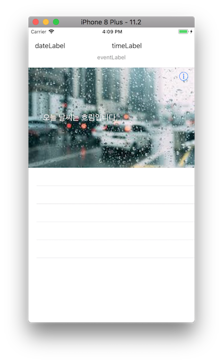
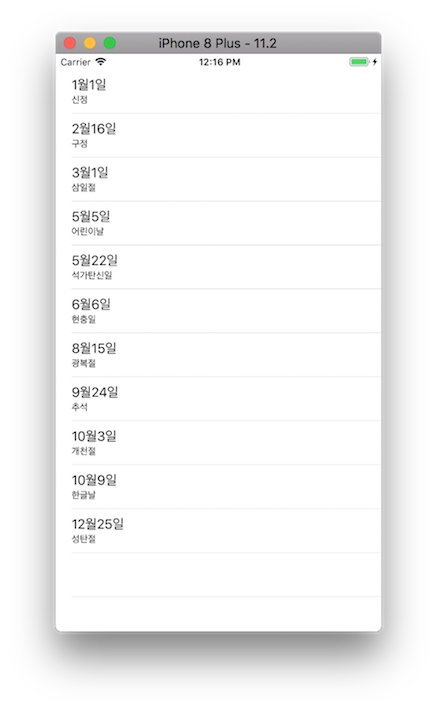
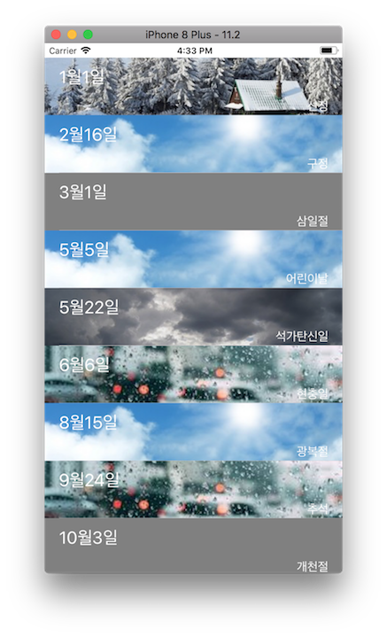
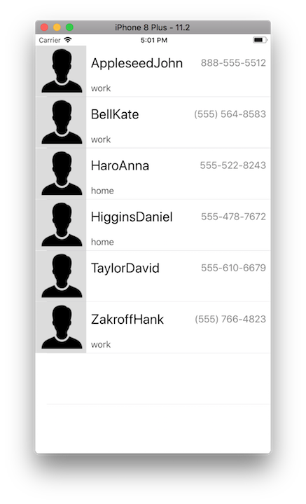
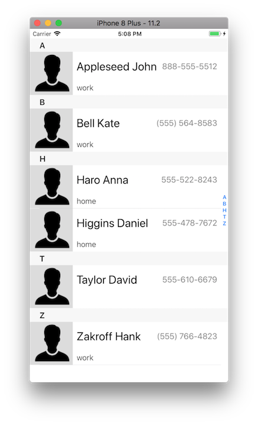

# 주소록 앱

## Step1 (시작하기 - UITableViewController)
### 요구사항
- iOS 프로젝트 Single View App 템플릿으로 하고 프로젝트 이름을 "AddressBookApp"으로 지정하고, 위에 만든 로컬 저장소 경로에 생성한다.
- 기본 상태로 아이폰 8 Plus 시뮬레이터를 골라서 실행한다.
- readme.md 파일을 자신의 프로젝트에 대한 설명으로 변경한다.
    - 단계별로 미션을 해결하고 리뷰를 받고나면 readme.md 파일에 주요 작업 내용(바뀐 화면 이미지, 핵심 기능 설명)과 완성 날짜시간을 기록한다.
    - 실행한 화면을 캡처해서 readme.md 파일에 포함한다.

### 프로그래밍 요구사항
- iOS 프로젝트 Single View App 템플릿으로 하고 프로젝트 이름을 "AddressBookApp"으로 지정하고, 위에 만든 로컬 저장소 경로에 생성한다.
- 아래 이미지 4장을 다운받아 Assets 에 추가한다.
    - http://public.codesquad.kr/jk/weather-sunny.png
    - http://public.codesquad.kr/jk/weather-cloudy.png
    - http://public.codesquad.kr/jk/weather-rainny.png
    - http://public.codesquad.kr/jk/weather-snowy.png
- 스토리보드에 새로운 TableViewController를 추가하고, Initial ViewController로 지정한다.
- 새로 추가한 TableViewController 속성에서 Content 값을 Static Cells로 변경한다. 그리고 DateTimeCell, WeatherCell 2가지 셀을 추가한다.
- DateTimeCell 부분을 다음과 같이 디자인한다.
    - 셀 높이는 80으로 지정
    - 가이드라인에 맞춰서 윗 부분에는 dateLabel과 timeLabel 이 폭을 2등분
    - dateLabel은 좌측 정렬, timeLabel은 우측 정렬
    - dateLabel과 timeLabel 높이는 24보다 크고 절반을 차지
    - 그 아래 eventLabel가 위치하고 높이는 20보다 크고 나머지 영역을 차지한다.
    - eventLabel 내용은 가운데 정렬하고, 글자 크기는 14, 글자색은 회색
- WeatherCell 부분을 다음과 같이 디자인한다.
    - UIImageView로 셀 전체에 배경 이미지를 지정한다.
    - 이미지는 에셋에 추가한 4장 중에 하나로 선택하고, contentMode를 aspectToFill 로 지정한다.
    - 그 위에 weatherDescription 과 detailButton을 위치한다.
    - weatherDesciption 글자 크기는 20, 글자색은 흰색으로 지정한다.
    - 설명은 배경 이미지에 맞춰서 문구를 지정한다.

### 결과
#### UI


---
## Step2 (DataSource 객체)
### 요구사항
- 동적으로 (Dynamic) 셀을 만들어서 테이블뷰를 채우는 방법을 학습한다.
- Delegate 패턴과 테이블뷰 동작에 대해 학습한다.
- readme.md 파일을 자신의 프로젝트에 대한 설명으로 변경한다.
    - 단계별로 미션을 해결하고 리뷰를 받고나면 readme.md 파일에 주요 작업 내용(바뀐 화면 이미지, 핵심 기능 설명)과 완성 날짜시간을 기록한다.
    - 실행한 화면을 캡처해서 readme.md 파일에 포함한다.

### 프로그래밍 요구사항
- 스토리보드에 새로운 ViewController (Scene)를 추가하고, Initial ViewController로 지정한다. (기존 TableViewController를 삭제하거나 남겨둬도 상관없음)
- 새로 추가한 ViewController.View에 TableView를 추가하고 화면 가득하게 채운다.
    - TableView.Content 속성은 Dynamic Prototypes 로 지정하고, Prototype Cells는 1로 설정한다.
    - 셀 프로토타입 Style은 Subtitle로 지정하고, reuse identifier 속성에 id를 고유한 값으로 지정한다.
- UIViewController 에서 상속받아 새로운 뷰컨트롤러 클래스 HolidayViewController를 만들고, 스토리보드 ViewController의 Custom Class로 지정한다.
    - TableView를 HolidayViewController 클래스의 IBOutlet으로 연결한다.
    - TableView.dataSource를 HolidayViewController로 지정한다.
- 다음과 같은 JSON 데이터를 HolidayViewController 코드에 추가하고 JSONSerialization을 활용해서 Array<Dictionary<String,String>> 타입으로 변환한다.
```
[{"date":"1월1일", "subtitle":"신정"},
{"date":"2월16일", "subtitle":"구정"},
{"date":"3월1일", "subtitle":"삼일절"},
{"date":"5월5일", "subtitle":"어린이날"},
{"date":"5월22일", "subtitle":"석가탄신일"},
{"date":"6월6일", "subtitle":"현충일"},
{"date":"8월15일", "subtitle":"광복절"},
{"date":"9월24일", "subtitle":"추석"},
{"date":"10월3일", "subtitle":"개천절"},
{"date":"10월9일", "subtitle":"한글날"},
{"date":"12월25일", "subtitle":"성탄절"}]
```
- HolidayViewController에 UITableViewDataSource 프로토콜을 채택하고 필수 메소드를 구현한다.
    - cell.textLabel 에는 date 값을 출력하고, cell.subtitle 에는 subtitle 값을 출력한다.

### 결과
#### UI


---
## Step3 (UITableViewCell 커스텀셀)
### 요구사항
- 테이블뷰 Custom 셀을 만들고, 테이블뷰를 채우는 방법을 학습한다.
- readme.md 파일을 자신의 프로젝트에 대한 설명으로 변경한다.
    - 단계별로 미션을 해결하고 리뷰를 받고나면 readme.md 파일에 주요 작업 내용(바뀐 화면 이미지, 핵심 기능 설명)과 완성 날짜시간을 기록한다.
    - 실행한 화면을 캡처해서 readme.md 파일에 포함한다.

### 프로그래밍 요구사항
- HolidayViewController.TableView에 새로운 프로토타입 Cell을 추가하고, Custom 스타일로 지정한다.
- 추가한 Custom cell은 높이를 80으로 하고 ImageView와 Label을 추가한다.
- UITableViewCell 에서 상속받는 HolidayTableViewCell 클래스를 추가하고 새로 추가한 셀의 Custom class로 지정한다.
    - Custom class 코드와 연결된 상태를 확인하고 각각 IBOutlet을 연결한다.
    - ImageView는 backgroundImageView로 셀 전체를 채운다.
    - dateLabel은 상단에 2/3를 차지하고, 글자크기는 24로 글자색은 흰색으로 지정하고 좌측 정렬한다.
    - subtitleLabel은 하단에 1/3을 차지하고, 글자크기는 17로 글자색은 흰색으로 지정하고 우측 정렬한다.
- 다음과 같은 JSON 데이터를 HolidayViewController 코드에 추가하고 JSONSerialization을 활용해서 Array<Dictionary<String,String>> 타입으로 변환한다.
```
[{"date":"1월1일", "subtitle":"신정", "image" : "snowy"},
{"date":"2월16일", "subtitle":"구정", "image" : "sunny"},
{"date":"3월1일", "subtitle":"삼일절"},
{"date":"5월5일", "subtitle":"어린이날", "image" : "sunny"},
{"date":"5월22일", "subtitle":"석가탄신일", "image" : "cloudy"},
{"date":"6월6일", "subtitle":"현충일", "image" : "rainny"},
{"date":"8월15일", "subtitle":"광복절", "image" : "sunny"},
{"date":"9월24일", "subtitle":"추석", "image" : "rainny"},
{"date":"10월3일", "subtitle":"개천절"},
{"date":"10월9일", "subtitle":"한글날", "image" : "cloudy"},
{"date":"12월25일", "subtitle":"성탄절", "image" : "snowy"}]
```
- UITableViewDataSource 프로토콜 구현 부분에서 cell을 HolidayTableViewCell 타입으로 변환해서 사용한다.
    - cell.dateLabel 에는 date 값을 출력하고, cell.subtitleLabel 에는 subtitle 값을 출력하고, backgroundImageView에는 image 값에 해당하는 이미지를 표시한다.
    - 만약 이미지가 없을 경우는 회색 배경이 보이도록 처리한다.

### 결과
#### UI


---
## Step4 (Contacts 프레임워크 적용)
### 요구사항
- Contacts 프레임워크를 학습하고, 주소록 데이터를 가져오는 모델 객체를 만든다.
- 주소록 데이터를 가져와 테이블뷰에 커스텀 셀로 채우도록 구현한다.
- 애플 개발자 문서에서 Contacts 관련 샘플 찾아 다운로드 받아서 압축을 푼다.
    - 자기만의 방식으로 샘플 코드 구조를 분석하세요.
- 이번 단계 앱 실행은 디바이스에서 실행하고 실제 동작 화면을 캡처한다.
- readme.md 파일을 자신의 프로젝트에 대한 설명으로 변경한다.
    - 단계별로 미션을 해결하고 리뷰를 받고나면 readme.md 파일에 주요 작업 내용(바뀐 화면 이미지, 핵심 기능 설명)과 완성 날짜시간을 기록한다.
    - 실행한 화면을 캡처해서 readme.md 파일에 포함한다.

### 프로그래밍 요구사항
- 다운로드 받은 샘플에서 MGCContactStore 클래스와 의존성이 있는 클래스를 최소로 함께 프로젝트에 복사한다.
- 스토리보드에 새로운 TableViewController를 추가하고, Initial ViewController로 지정한다.
- UITableViewController 에서 상속받아 새로운 뷰컨트롤러 클래스 AddressBookViewController를 만들고, 스토리보드 TableViewController의 Custom Class로 지정한다.
- 복사한 MGCContactStore 클래스 메소드를 활용해서 주소록에 있는 전체 Contacts 정보를 Fetch하고, TableViewDataSource에서 활용한다.
- 새로 추가한 TableViewController 속성에서 Content 값을 Dynamic Prototypes로 변경하고 Custom 셀을 추가한다.
- 추가한 Custom cell은 높이를 90으로 하고 ImageView와 Label 3개를 추가한다.
- UITableViewCell 에서 상속받는 AddressTableViewCell 클래스를 추가하고 새로 추가한 셀의 Custom class로 지정한다.
    - 셀 Identifier는 addressCell 로 지정한다.
    - Custom class 코드와 연결된 상태를 확인하고 각각 IBOutlet을 연결한다.
    - ImageView는 profileImageView로 셀 좌측에 정사각형으로 고정한다.
    - nameLabel은 상단에 높이 2/3를 차지하고, 글자크기는 24로 글자색은 검정색으로 지정하고 좌측 정렬한다.
    - telLabel은 nameLabel과 동일한 높이에, 글자크기는 17로 글자색은 옅은 회색으로 지정하고 우측 정렬한다.
    - emailLabel은 하단에 1/3을 차지하고, 글자크기는 16로 글자색은 진한 회색으로 지정하고 좌측 정렬한다.
- 주소록 정보 중에 다음과 같이 셀에 표시한다.
    - cell.nameLabel 에는 lastName + firstName 값을 출력하고, cell.telLabel 에는 phoneNumber 값을 출력하고, cell.emailLabel에는 email 값을 출력하고, profileImageView에는 profilePicture.imageData 를 이미지로 표시한다.
    - 만약 프로필 이미지가 없을 경우는 기본 이미지가 보이도록 처리한다.

### 결과
#### UI


---
## Step5 (주소록 섹션 정렬과 인덱스)
### 요구사항
- 주소록 데이터를 가져와 테이블뷰에 커스텀 셀로 채우도록 구현한다.
- 이번 단계 앱 실행은 디바이스에서 실행하고 실제 동작 화면을 캡처한다.
- readme.md 파일을 자신의 프로젝트에 대한 설명으로 변경한다.
    - 단계별로 미션을 해결하고 리뷰를 받고나면 readme.md 파일에 주요 작업 내용(바뀐 화면 이미지, 핵심 기능 설명)과 완성 날짜시간을 기록한다.
    - 실행한 화면을 캡처해서 readme.md 파일에 포함한다.

### 프로그래밍 요구사항
- 주소록에 있는 전체 Contacts 정보를 Fetch한 다음에 성-이름 순으로 오름차순 정렬을 하고, 아래 그림처럼 sectionHeader를 이용해서 초성 단위로 section을 구분한다.
    - 새로운 화면에 필요한 데이터 구조는 개선한다.
- Section과 매칭해서 곧바로 원하는 위치로 스크롤해서 이동할 수 있도록 인덱스제목(indexTitle)을 지정한다.
    - 인덱스에서 타이틀을 누르면 해당 Section으로 이동하도록 설정한다.

### 결과
#### UI


---
## 중간에 고생했던 부분 / 기억할 부분 간단 정리
- contentMode
    - Scale To Fill : 정해져 있는 UIImageView의 사이즈에 맞춰 사진 사이즈가 조정된다.
    - Aspect Fit : 정해져 있는 UIImageView의 사이즈의 width나 height 중 사진과 대비하여 작은 사이즈에 맞춰 사진 크기가 조정된다.
    - Aspect Fill : 사진의 사이즈에 맞춰 UIImageView의 사이즈가 조정된다.
- TableViewController의 TableView 속성에서 Content 값을 Static Cells로 정하면 기본 뷰의 디자인을 기호에 맞게 정의할 수 있다.

- UITableViewController
    - Table View를 컨트롤하는 객체
    - Table View
        - header와 footer존재
        - Section이 구분되고 Section 마다 header와 footer가 존재한다.
        - Section 내에는 각 데이터를 포함하는 Table Cell이 있다.
- JSON 파일을 이용할 때는 로컬이든 웹에서 가져오는 데이터든 URL객체를 사용해서 불러와야한다.
- UITableViewDataSource 프로토콜
```Swift
func tableView(_ tableView: UITableView, numberOfRowsInSection section: Int) -> Int
func tableView(_ tableView: UITableView, cellForRowAt indexPath: IndexPath) -> UITableViewCell
```
    - 위의 두 메소드를 필수로 구현해줘야 한다.
    - 위의 경우 한 Section당 몇개의 데이터(cell)가 포함되는지 정의해주는 부분
    - 아래의 경우 각 Cell에 어떤 데이터가 채워질지를 정의할 수 있다.
- Contacts에 접근권한을 요청하기 위해 plist에 NSContactsUsageDescription(Privacy - Contacts Usage Description) 을 추가해줘야한다.
- 한글 초성 분리
    - UTF-8기준 코드와 unicodeScalars를 이용
    - swift에서 아래와 같은 기능 지원
```
let precomposed: Character = "\u{D55C}"                  // 한
let decomposed: Character = "\u{1112}\u{1161}\u{11AB}"   // ᄒ, ᅡ, ᆫ
// precomposed is 한, decomposed is 한
```
